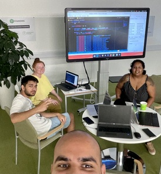

    ________            _____       ______ ______     
    __  ___/______________  /______ ___  /____  /____ 
    _____ \_  __ \_  ___/  __/  __ `/_  __ \_  /_  _ \
    ____/ // /_/ /  /   / /_ / /_/ /_  /_/ /  / /  __/
    /____/ \____//_/    \__/ \__,_/ /_.___//_/  \___/ 
                                                  

# [Sortable ](https://github.com/01-edu/public/tree/master/subjects/sortable)

This project involves in creating a table, and making the columns sortable in either ascending or descending order using the data,
received via: `https://rawcdn.githack.com/akabab/superhero-api/0.2.0/api/all.json`

# Built using HTML / CSS / Vanilla JS

# Project Authors:
- Gowseny
- Helena
- [https://github.com/nik-don](https://github.com/nik-don) - Nik Don
- Umair

# Features:
    -   Search all fields for Super Heroes stats
    -   Paginate the amount of results

[https://01f-sortable.vercel.app] - DEPLOYED
Here you can find statistics and information about Super Heroes.

# To Do

🛠 ~~⭐⭐⭐ 

🔎  ~~Deploy

🛠 

🛠 

🛠 

🛠 

🛠 

🛠 

🔎 

🔎 